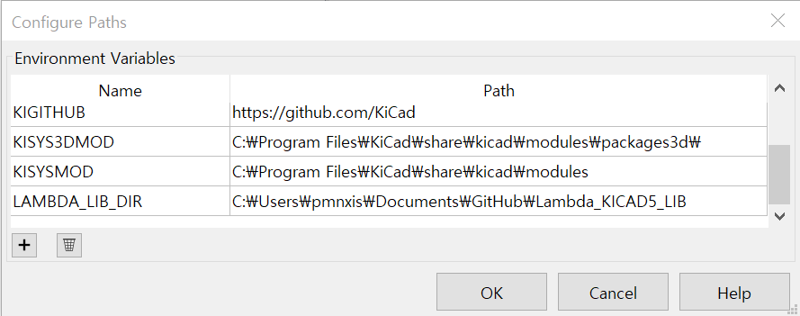
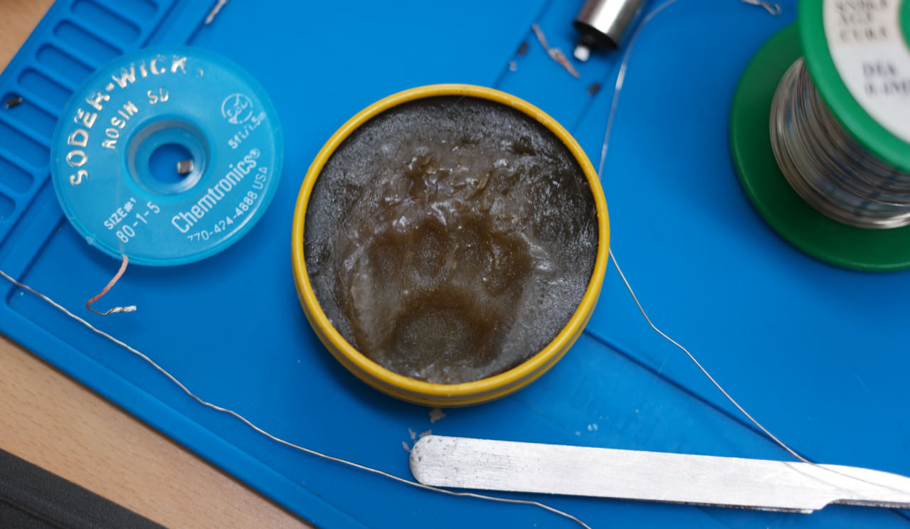

# Lambda_KICAD_LIB

Lambda Series Kicad6 Lib
```
Welcome to ES&EE CAT Ph.D Lambda λ 's Lab.
The KICAD library used and drawn by cat, her name is Lambda λ
Recent days, λ is trying to use KICAD. And she decided to share some libraries for public.
```

## Transition to Kicad6
Now This library changed to Kicad6 version.
Previous library is legacy format. Thus apply new libary format.

## Update schedule.
If there's new part using in KICAD from my job or hobby. It will be update asap.

## Required Parameters for SchLib.
Some rules are applied on schlib.

### MFR.Part#
Order Name of Chip.
* MB85RC16PNF-G-JNERE1
* RT8272GSP

### ODR.Part#
Allias of "MFR.Part#" or 
Gerneric_Value__Size__Spec for LRC or descrition
* FRAM IC 16Kb (2K x 8) I²C < But this case only available swappable.
* RT8272GPS < This case for no alternative.

### Manufacturer
* Fujitsu

### Mount
* SMD
* TH
* NC

### Packaging
* SOIC-8 
* TSSOP-24-EP

### Supplier
* JLCPCB-Basic
* JLCPCB-Extended
* LCSC
* Digikey
* Mouser
* Eleparts
* Korean Distrubute

### LCSC Part
* Only Available for "JLCPCB-Basic" and "JLCPCB-Extended"

## Note for 3d Model Owner
Some 3d model files are downloaded from other website. Original designer's name will be writen.

The path of each model's reference info is in "LAMBDA_LIB_DIR/3DShapes/**/*.Ref.txt"


## Add "LAMBDA_LIB_DIR" PATH on Kicad Configuration.

Kicad >> Preferences >> Configure Paths..

Click '+' and add LAMBDA_LIB_DIR for name, and Path is root of this git.

There's problem kicad cannot associate 3d model with relative path from kicad footprint path.


## Why don't you upload on official library git.
I have different guidelines and I consider for the BOM based on JLCPCB and Korean turnkey services.
So some parameters can be useful for your works or not.

## License

Free for commercial and Non-commercial usage. But you can give Churu(ちゅ~る) to λ. She draw libary for my work. and test those library with SMT and fabrication.
