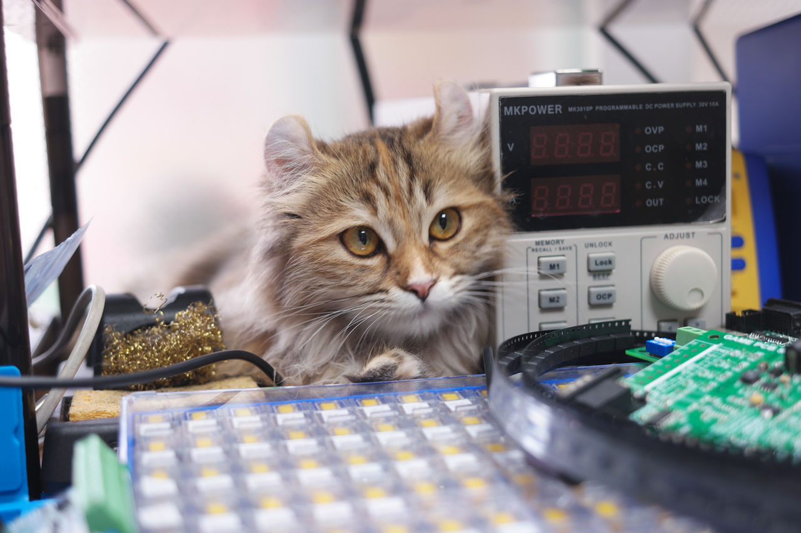

# Lambda_KICAD5_LIB

Lambda Series Kicad5 Lib
```
The kicad5 library used and drwan by cat, her name is Lambda λ
Recent days, λ are trying to using kicad5. And she decided to share some libraries for public.
```

## Required Parameters
Some rules are applied on schlib.

### MFR.Part#
Order Name of Chip.
* MB85RC16PNF-G-JNERE1
* RT8272GSP

### ODR.Part#
Allias of "MFR.Part#" or 
Gerneric_Value__Size__Spec for LRC or descrition
* FRAM IC 16Kb (2K x 8) I²C < But this case only available swappable.
* RT8272GPS < This case for no alternative.

### Manufactor
* Fujitsu

### Mount
* SMD
* TH
* NC

### Packaging
* SOIC-8 
* TSSOP-24-EP

### Supplier
* JLCPCB-Basic
* JLCPCB-Extended
* LCSC
* Digikey
* Mouser
* Eleparts
* Korean Distrubute

### LCSC Part
* Only Available for "JLCPCB-Basic" and "JLCPCB-Extended"